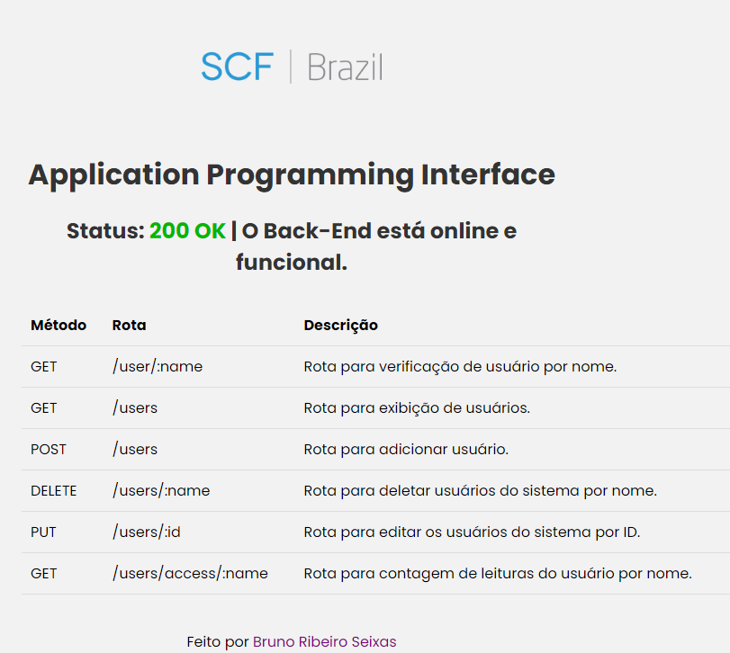
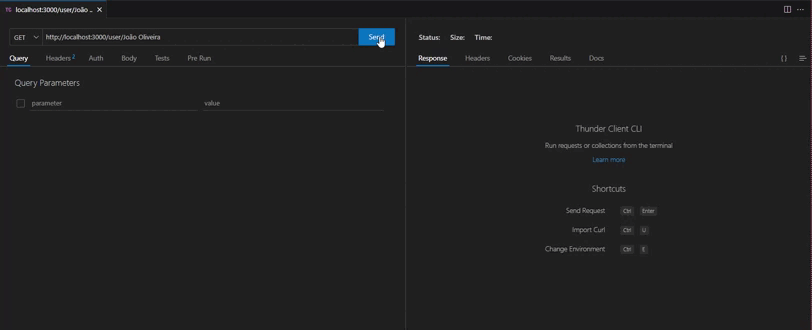
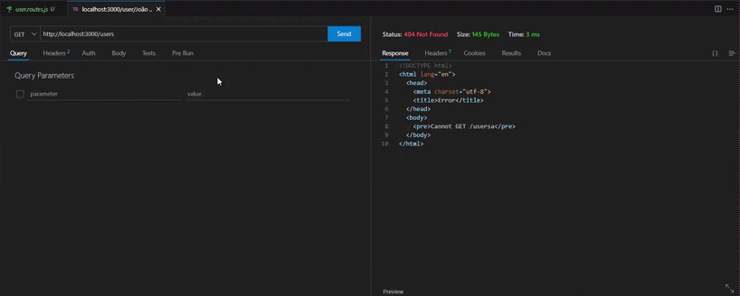
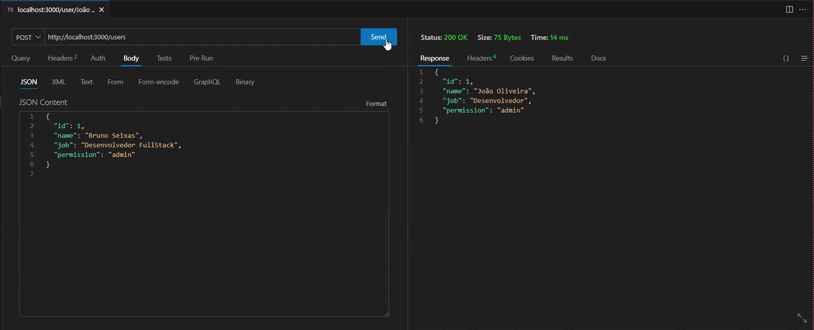
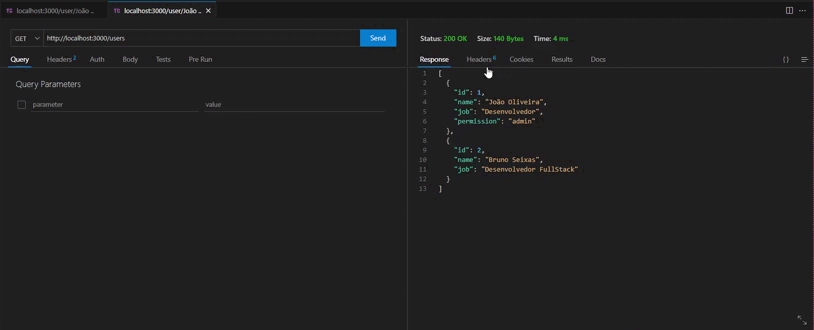
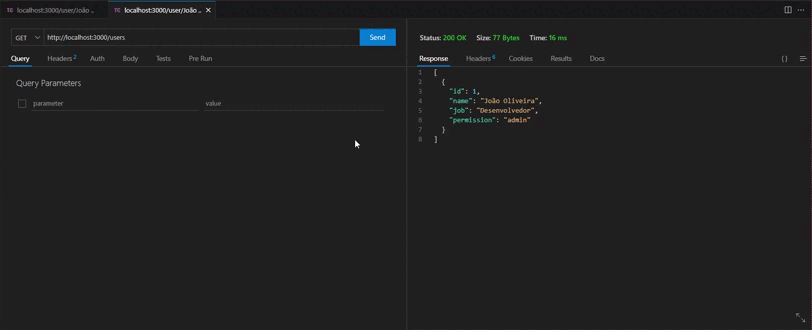
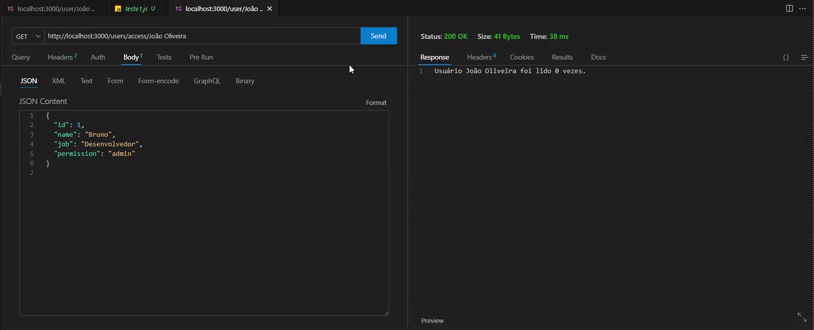

# Mudanças realizadas:
1. Foi realizado uma organização da api com o padrão MVC (Model-View-Controller) ou o padrão de arquitetura de microservices.
2. Instalação do nodemon para melhor testagem do codigo em desenvolvimento. Ele monitora os arquivos do seu projeto e reinicia automaticamente o servidor sempre que detecta alterações nos arquivos.
3. Algumas linhas que utilizam o body-parser foram removidas pois a partir da versão 4.16.0 do Express não há mais nescessidade.
4. Foi tambem utilizado o comando `yarn remove body-parser` para a remoção o body-parser.

## Como executar o projeto

1. Clone este repositório em sua máquina local.
2. Certifique-se de ter o MongoDB instalado e em execução.
3. Navegue até o diretório raiz do projeto e execute o comando `yarn install` para instalar as dependências do servidor.
5. Volte para o diretório raiz e execute o comando `yarn run dev` para iniciar o servidor e o cliente simultaneamente.
6. O projeto estará disponível em `http://localhost:3000`.

## O projeto está organizado da seguinte forma:

A pasta api é a pasta principal do projeto.
    Dentro dela, temos a pasta src, que contém os arquivos principais de código do projeto.
    A pasta src está dividida em duas subpastas: db e controllers.
### Controllers:
    A pasta controllers contém os arquivos responsáveis por lidar com as requisições HTTP recebidas pelo servidor e retornar as respostas apropriadas. Os controllers encapsulam a lógica relacionada a cada rota específica. 
### DB:
    A pasta db se refere ao banco de dados utilizado no projeto. Ela armazena os dados relacionados à entidade "Usuários".
### Middlewares:
    A pasta Middlewares contém o middleware de autenticação que é utilizado nas rotas de update e delete.
### Routes:
    A pasta Routes contém as rotas nescessárias para o funcionamento do projeto, exite um arquivo HTML que explica um pouco melhor sobre elas: 
    Ele pode ser acessado quando o projeto é iniciado no rota "/"

# Explicação e demonstração das rotas:
1. Rota de GET `/user/:name` que retorna o usuário pesquisado por nome do banco sem nenhuma autenticação.

2. Rota de GET `/users` que retorna todos os usuários no banco sem nenhuma autenticação.

3. Rota de POST `/users` que cria um usuário no banco sem nenhuma autenticação.

4. Rota de DELETE `/users/:name` que apaga um usuário no banco com a autenticação do tipo admin.

5. Rota de PUT `/users/:id` que atualiza um usuário no banco com a autenticação do tipo admin.

6. Rota de GET `/users/access/:name` que retorna pelo nome do usuário quantas vezes ele foi lido pelo medoto da primeira rota sem nenhuma autenticação.

## Autores

- [@iBrunos](https://www.github.com/iBrunos)
   # ---> Readme Antigo 
# Este é um teste para desenvolvedores

# possui 5 testes

## Introdução

Este projeto possui um banco de dados fake em fakeData.js com apenas um registro.
A ideia é melhorar e o CRUD escrito nos 4 arquivos de teste abaixo.

Será a validada a forma de escrita de código.
Escreva códigos que humanos consigam entender.

Fique a vontade para fazer modificaçoes nos serviços, comentários em código, estrutura, mas seja objetivo.

## teste1.js

GET em /user 

Possuimos neste arquivo um serviço que faz uma busca no banco fake e retorna um registro.
Este código funciona, mas é possivel melhorar.
Veja o que pode deixar ele melhor escrito e mais performatico.

## teste2.js

POST em /users, descubra a intenção dele e o corrija.

## teste3.js

Este procura um usuário e o deleta da base.
Retorne sucesso para o client caso realmente tenha sido excluido e deixe o código mais performatico.

## teste4.js

Atualiza os dados de um usuário especifico.

## teste5.js

Retorne quantas vezes determinado usuário foi lido no teste1.

## teste 6

Definina uma forma de criar permissão para o usuario, defina se o usuário pode deletar ou atualizar usuários. Crie um middleware para validar essas permissões e adicione no teste4 e teste3.

